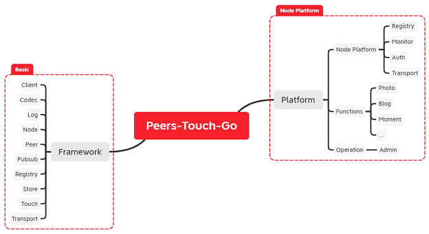
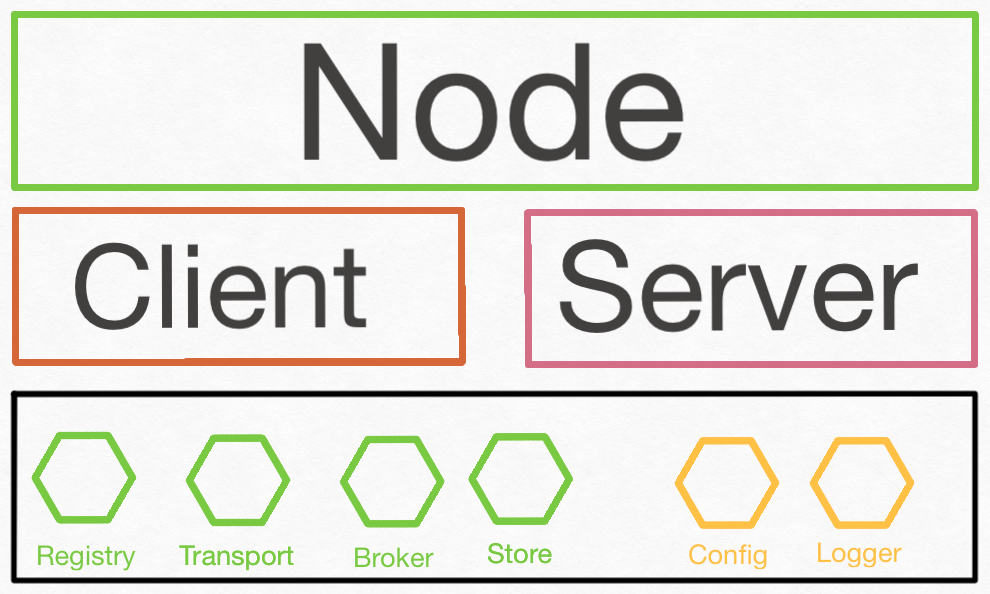
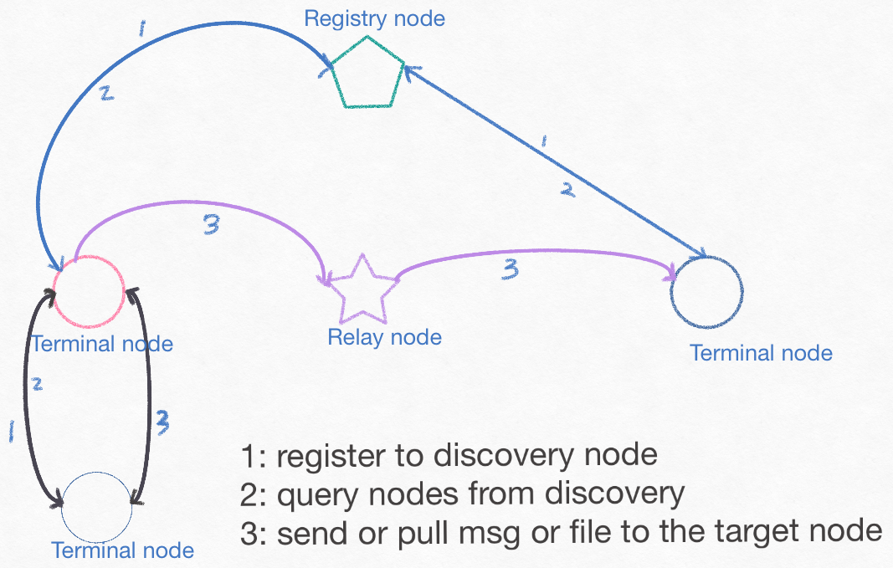
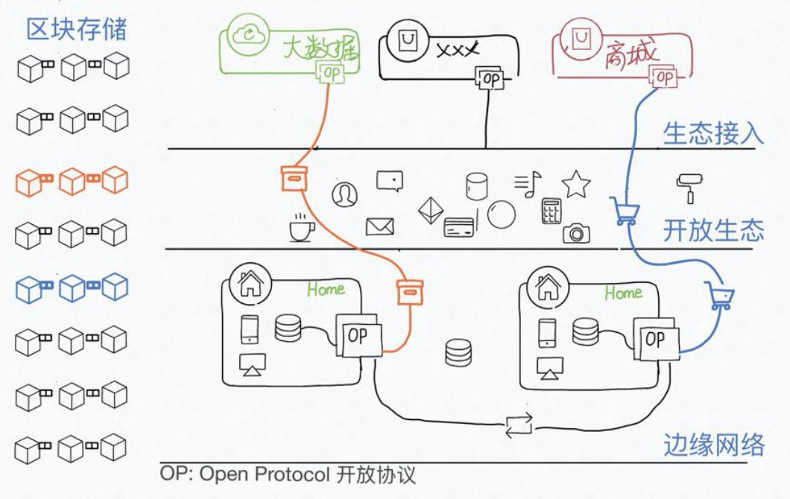

# Stack

Stack is an edge-network dev framework based on golang. It builds the Sub/Pub, Stream-Exchange, Text-Communication models for various network environments, such as RPC, P2P scenarios.

> Stack is currently in its initial development phase and therefore there will be a lot of breaking changes.

## RPC

[For RPC](./README_RPC.md)

## Edge-Network

Edge social network communication dev framework in Go. It will support Sub/Pub msg and exchange file.

Why do we create this?

We need to build a world without AI, BigData. Huge companies are prying into our personal life and tracing whole private things. Human in this world should respect each other's privacy. No man analyzes our data in the place we don't know.

So now you know, We hate the big companies hold all data of ours.

## Structure

Inspired by Go-Micro and Orbit-db.



```
--Log
--Peer
----Codec
----Pubsub
----Registry
----Store
----Transport
-------------Touch
------------------Node
```

### Node

Node is the smallest indivisible unit for exchanging data in peers-net. It includes `Transport`, `Broker`, `Store`, `Registry` for the outside and `Config`, `Logger` for the inside.

See architecture as below:



#### Types of Node

- Relay Node: Gateway, nodes in public network logically. Helps other types nodes communicate within the bad network.

- Terminal Node: Users' nodes.

- Registry Node: Registry Center. Helps nodes look for others. 'Center' doesn't mean this kind of node is necessary. We use this for easy discovery.

Types can be init at one node which means a node could have tree types. Those types run in one or multi-process.

### Communication

We have two top communications functions, pub/sub and transport files. Except Pub/Sub Event msg, every thing transported in the network is file. Such as Blog page file, image file, short post like Twitter.

Files should be stored in node if they don't shared as public, but if people like some files to be public or share them with some extra people, the node will help them to make the files as BitTorrents or Magnets.

Node communication looks like:



# 中文

边缘社交网络通信开发框架，提供去中心化的通信组件，支持消息订阅、发布，支持远程文件传输。

在这个到处都是埋点上报，数据分析，精准广告的年代，我们隐私在各个厂商之间共享，他们带来所谓的方便，是基于对我们隐私的窥探。

我们需要构建一个真实的用户互联网络生态，支持去除个人数据，匿名交流，拥有不可篡改的受信机制。



### Node 类型

- 节点类型
    - 中继节点：网关，公网节点，用于NAT节点之间的通信中继，不干涉与不猜测消息内容，透明但有条件（如安全、验证等）过桥传输
    - 终端节点：不限网络的节点，数据的来源与最终去向
    - 注册节点：公网节点，用于NAT节点中继节点的注册

部分参考Go-Micro及Orbit-db的设计

### 安全

没有绝对安全的系统，但是却有随时可以掐断网络访问的节点，它就在你身边。